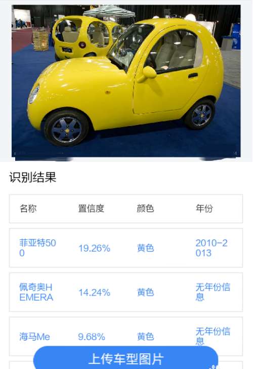
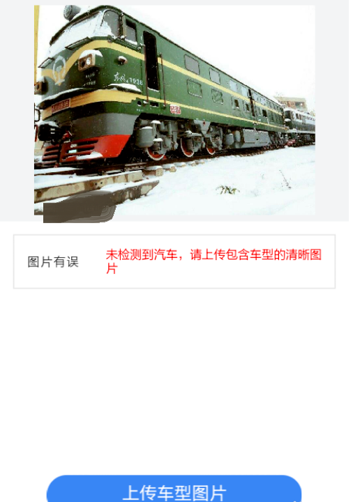

## • 产品要求

 | target release | 01/01/2019 |
 | ------ | ------ |
 | epic | 检测车辆图片可以识别出车型的app |
 | Document Status | 进行中 |
 | Document owner | 覃沛聪 |
 | Designer | 覃沛聪 |
 | Developer | 覃沛聪 |
 | QA | 覃沛聪 |

## • 目标

让用户只要有手机就能随时随地识别车型，简化他们识别车型的操作，多了解汽车行业不同品牌的型号

## • 背景

中国开始逐渐步入全民小康时代,每家每户必不可少的就是汽车,但是普通老百姓甚少接触汽车行业，对于不同品牌型号都不太了解，如果做一个上传车辆图片就可以识别车型的app,可以方便用户了解不同品牌汽车的型号，可以帮助他们在买汽车的时候对汽车有更多的了解与认知

## • 假设

用户会在街上拍下汽车的照片或者上网搜索汽车照片上传到app识别车型

## • 要求

| # | Title | User story | Importance | Note |
| ------ | ------ | ------ | ------ | ------ |
| 1 |  路遇汽车  | 用户在路上遇到喜欢的车的外形，用手机拍下之后上传到app识别车型 | 非常重要 | 可能是用户会接触到汽车的最多的途径  |
| 2 |  上网搜索  | 用户在网上见到喜欢的车的外形，保存下来之后上传到app识别车型 | 非常重要 | 上网是用户可以见到不同车辆的最好的途径  |

 ## • 用户交互和设计 :
 
 
 流程图：
 
 
 ## • 问题: 
 
 | question | outcome |
 | ------ | ------ |
 | 上传的车辆图片有要求 | 将图片要求标注在app里 |
 
 ## • Not doing: 
 识别车型的同时可以返回车辆价格的结果，各种车店的位置和价格
 
 # • 实在细节
 
 ## • 加值宣言
 该产品app会使用百度的识别图型中的识别车型API，app最主要的功能是上传车辆图片即可返回车辆的车辆品牌及具体型号、颜色、年份
 
 ## • 核心价值
该产品的核心价值是通过上传的车辆图片可以识别车型返回车辆的车辆品牌及具体型号、颜色、年份

 ## • 用户痛点
 多数用户不懂车辆品牌型号等等，在路上看见喜欢的车，上网搜索也难以正确搜索出来，通过这款app可以让用户轻松简单识别车型，只需要拍照或者搜索图片
 
 ## • 人工智能概率性
•  搜索得出的结果概率超过90%的基本上是可信的
 

•  汽车模型如果足够逼真，也可以成功识别。
 
 
•  概念车的识别效果，就不那么准确。
 
 
•  古董车的识别结果，不可信。
 
 
•  MINI车型和改装车型，难以识别，因为其样式过于多样化了。
 
 
 
•  电动汽车不能被当成汽油汽车对待。
 
 
•  不能识别火车、两轮车和三轮车
 
 
 
 
 
 ## • 使用分析比较
• VIN码查询：这是一个非常成熟的车辆识别API，根据VIN码准确定型，获取保险车辆列表(含配置信息) 包含:车型代码，唯一标识、车型名称、品牌名称、车系名称、车组名称、排量、发动机描述、发动机型号、进气形式、汽缸排列形式等等，这么多专业的配置信息并不是本app所必需的，最有核心的价值是车辆的品牌型号，因为大多数用户都不会过多关注这么多专业的配置名词。收费的价格是0.1元/次，我认为性价比是不值得的

• 百度AI车型识别：主要用于检测一张车辆图片的具体车型，输入一张车辆图片，输出图片的车辆品牌及型号、颜色及年份、位置信息。输出车辆品牌型号是本app的核心价值。每日500次免费调用额度，免费额度用尽后开始计费，价格如下：

 | 月调用量（万次） | 车型识别（元/千次） |
 | ------ | ------ |
 | 0<月调用量<=5 | 3.0 |
 | 5<月调用量<=10 | 2.8 |
 | 10<月调用量<=20 | 2.5 |
 | 20<月调用量<=50 | 2.0 |
 | 50<月调用量<=100 | 1.8 |
 | 100<月调用量 | 1.5 |
 
 调用失败不计费，我认为百度AI的车型识别API性价比是非常高，非常适合本app的核心价值观念
 
## • 使用后风险报告
• API市场竞争程度：市场竞争较小，市面上很少关于车型识别的应用程序，有百度开发的识别车型的微信小程序

• 可替代的程序库：可以自行建立车辆信息的数据库，不需要再用百度识别车型API

## • 代码展示：
请求代码示例：

<pre><code># encoding:utf-8
import base64
import urllib
import urllib2

request_url = "https://aip.baidubce.com/rest/2.0/image-classify/v1/car"

# 二进制方式打开图片文件
f = open('[本地文件]', 'rb')
img = base64.b64encode(f.read())

params = {"image":img,"top_num":5}
params = urllib.urlencode(params)

access_token = '[调用鉴权接口获取的token]'
request_url = request_url + "?access_token=" + access_token
request = urllib2.Request(url=request_url, data=params)
request.add_header('Content-Type', 'application/x-www-form-urlencoded')
response = urllib2.urlopen(request)
content = response.read()
if content:
    print content
</code></pre>

返回示例：
<pre><code>
HTTP/1.1 200 OK
x-bce-request-id: 73c4e74c-3101-4a00-bf44-fe246959c05e
Cache-Control: no-cache
Server: BWS
Date: Tue, 18 Oct 2016 02:21:01 GMT
Content-Type: application/json;charset=UTF-8
{
	"log_id": 4086212218842203806,
	"location_result": {
		"width": 447,
		"top": 226,
		"height": 209,
		"left": 188
	},
	"result": [{
		"baike_info": {
			"baike_url": "http://baike.baidu.com/item/%E5%B8%83%E5%8A%A0%E8%BF%AAChiron/20419512",
			"description": "布加迪Chiron是法国跑车品牌布加迪出品的豪华超跑车。配置四涡轮增压发动机，420 公里每小时，有23种颜色的选择，售价高达260万美元。"
		},
		"score": 0.98793351650238,
		"name": "布加迪Chiron",
		"year": "无年份信息"
	},
	{
		"score": 0.0021970034576952,
		"name": "奥迪RS5",
		"year": "2011-2017"
	},
	{
		"score": 0.0021096928976476,
		"name": "奥迪RS4",
		"year": "无年份信息"
	},
	{
		"score": 0.0015581247862428,
		"name": "奥迪RS7",
		"year": "2014-2016"
	},
	{
		"score": 0.00082337751518935,
		"name": "布加迪威航",
		"year": "2004-2015"
	}],
	"color_result": "颜色无法识别"
</code></pre>

## • 共享原型文档
### • [代码展示](https://github.com/Butterrrr/API_ML_AI/blob/master/code%20display.md)
### • [百度车型识别API文档](http://ai.baidu.com/docs#/ImageClassify-API/fe686c3a)
